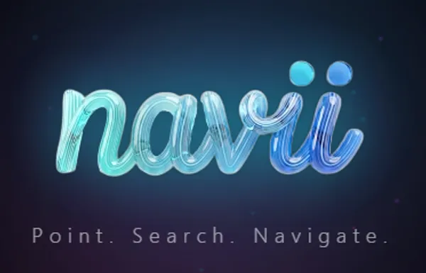

 

  

# Ahmad Hasan

**Co-founder & CTO &nbsp;@&nbsp; [Constant Labs](https://constantlabs.ai)**

Physicist turned builder &nbsp;·&nbsp; Dubai, UAE

 

&nbsp;

&nbsp;

 

---

 

I build AI platforms, mobile apps, IoT systems, and service robots.

Applied Physics & Astrophysics &nbsp;·&nbsp; UAE Space Hackathon Winner

 

---

 

## `// CONSTANT LABS` &nbsp; 

> End-to-end technology studio — Dubai, UAE
>
> We build and ship AI agents, web & mobile apps, e-commerce, indoor navigation, service robots, and local AI deployment for businesses across the Gulf.

 

---

 

## `// AI & LANGUAGE`

<table>
<tr>
<td width="140" align="center">
 

  
</td>
<td>

### [MUFAKKIR](https://mufakkir.app) &nbsp; 

Voice-to-text Arabic transcription with AI. Real-time speech recognition across **50+ languages** and **10+ Arabic dialects** — Gulf, Levantine, Egyptian, Maghrebi. Transform spoken words into organized notes.

`AI` `Speech-to-Text` `Arabic` `Multi-dialect`

</td>
</tr>
<tr>
<td width="140" align="center">
 

  
</td>
<td>

### [VOICETYPE](https://github.com/Astrobubu/Speak-to-Windows) &nbsp; 

Dictate anywhere on your PC. Hit a keyboard shortcut, speak, and words type directly into any active application — no copy-paste. Works in every text field on Windows.

`JavaScript` `Speech API` `Windows` `Hotkeys`

</td>
</tr>
</table>

 

## `// ISLAMIC & SPIRITUAL`

<table>
<tr>
<td width="140" align="center">
 

  
</td>
<td>

### [MOSQUE SILENCE](https://github.com/Astrobubu/MosqueSilence) &nbsp; 

Auto-silences your phone when you enter a mosque. GPS-based proximity detection, battery-efficient background service, and a curated UAE mosque database.

`Flutter` `Dart` `Geolocation` `Android`

</td>
</tr>
<tr>
<td width="140" align="center">
 

  
</td>
<td>

### [CRESCENT WATCH](https://crescent-watch.vercel.app/) &nbsp; 

Precision lunar crescent visibility tracker. Determine Ramadan, Eid, and Islamic calendar dates worldwide with interactive maps and scientific accuracy.

`React` `Astronomy Data` `Maps` `Simulation`

</td>
</tr>
</table>

 

## `// RESEARCH & CREATIVE`

<table>
<tr>
<td width="140" align="center">
 

  
</td>
<td>

### [PAPER TO PRODUCT](https://papertoproduct.vercel.app/) &nbsp; 

Research intelligence platform. Search **225M+ papers** and **12M+ patents**, discover expired patents ready for commercialization, and convert academic research into product specs with AI.

`React` `AI` `Search` `SaaS`

</td>
</tr>
</table>

 

## `// HARDWARE & ROBOTICS`

<table>
<tr>
<td width="140" align="center">
 

  
</td>
<td>

### GUIDEON &nbsp; 

Modular AI-powered kiosk robot. Fully 3D-printed, autonomous, handles roles from coffee-serving to reception. Expressive gestures, smart chat, and a modular design that adapts to any industry. Designed and built in Dubai.

`Robotics` `AI` `3D Printing` `ROS`

</td>
</tr>
<tr>
<td width="140" align="center">
 

  
</td>
<td>

### [NAVII](https://constantlabs.ai/navii) &nbsp; 

AR indoor navigation for malls, airports, and large indoor spaces. Where GPS fails, Navii uses AR markers and computer vision for turn-by-turn guidance. Built for Dubai's mega-malls.

`AR` `Indoor Navigation` `Computer Vision`

</td>
</tr>
</table>

 

---

 

## `// STACK`

&nbsp;&nbsp;

&nbsp;&nbsp;

&nbsp;&nbsp;

 

---

 

  

applied physics & astrophysics &nbsp;·&nbsp; UAE space hackathon winner &nbsp;·&nbsp; Dubai, UAE

