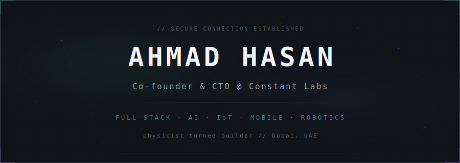
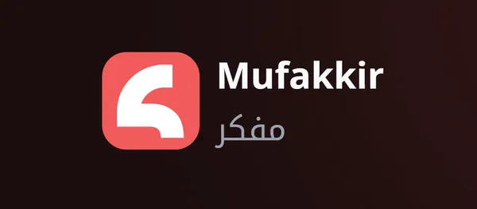
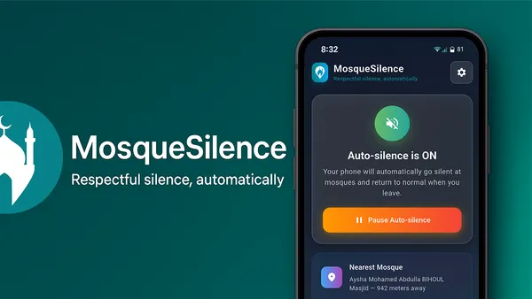
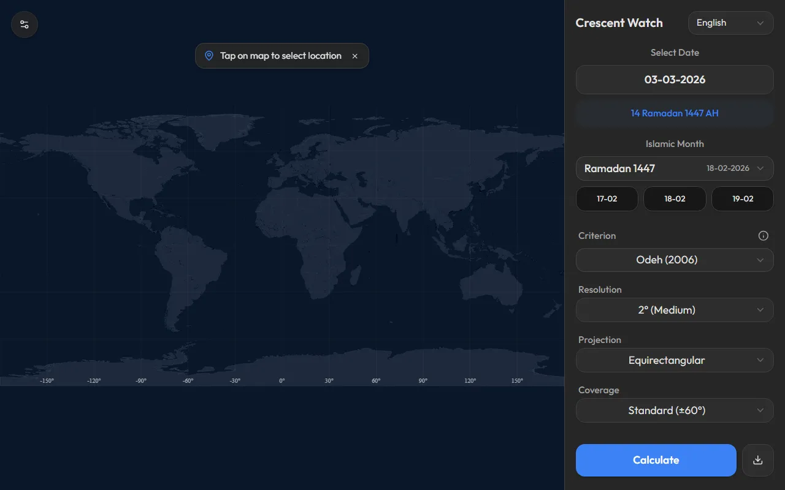
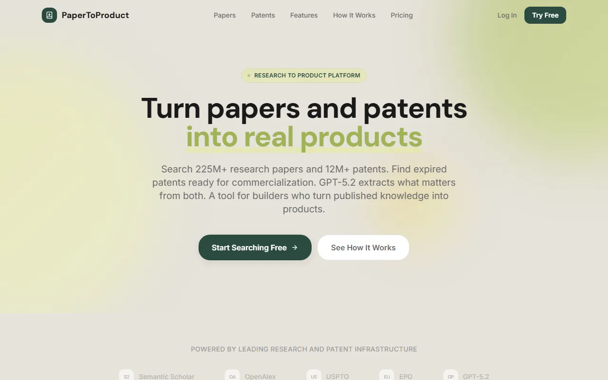
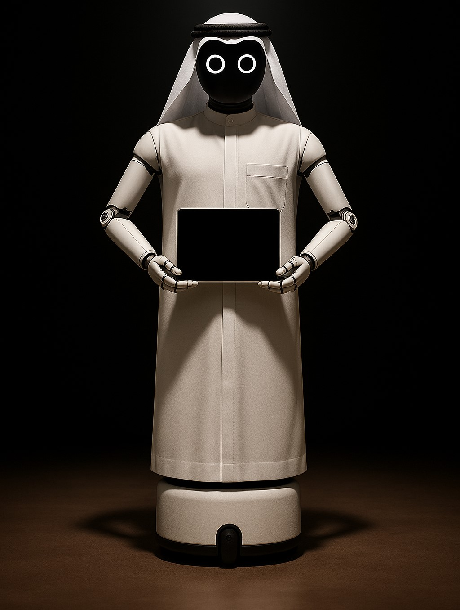

  

&nbsp;&nbsp;

&nbsp;&nbsp;

 

 

## `// STARTUP`

> **[Constant Labs](https://constantlabs.ai)** — End-to-end technology studio, Dubai
>
> AI agents, web & mobile apps, e-commerce, service robots, local AI deployment.
> We ship for restaurants, clinics, car shops, luxury brands, and more across the UAE.

 

 

## `// AI & LANGUAGE`

<table>
<tr>
<td width="130" align="center" valign="top">
 

 
<b>LIVE</b>
  
</td>
<td valign="top">
 

**[MUFAKKIR](https://mufakkir.app)**

Voice-to-text Arabic transcription with AI. Real-time speech recognition across **50+ languages** and **10+ Arabic dialects** — Gulf, Levantine, Egyptian, Maghrebi.

`AI` &nbsp; `Speech-to-Text` &nbsp; `Arabic` &nbsp; `Multi-dialect`

 
</td>
</tr>
<tr>
<td width="130" align="center" valign="top">
 

 
<b>REPO</b>
  
</td>
<td valign="top">
 

**[VOICETYPE](https://github.com/Astrobubu/Speak-to-Windows)**

Dictate anywhere on your PC. Hit a shortcut, speak, and words type directly into any active app — no copy-paste.

`JavaScript` &nbsp; `Speech API` &nbsp; `Windows` &nbsp; `Hotkeys`

 
</td>
</tr>
</table>

 

## `// ISLAMIC & SPIRITUAL`

<table>
<tr>
<td width="130" align="center" valign="top">
 

 
<b>REPO</b>
  
</td>
<td valign="top">
 

**[MOSQUE SILENCE](https://github.com/Astrobubu/MosqueSilence)**

Auto-silences your phone when you enter a mosque. GPS proximity detection with a curated UAE mosque database. Battery-efficient background service.

`Flutter` &nbsp; `Dart` &nbsp; `Geolocation` &nbsp; `Android`

 
</td>
</tr>
<tr>
<td width="130" align="center" valign="top">
 

 
<b>LIVE</b>
  
</td>
<td valign="top">
 

**[CRESCENT WATCH](https://crescent-watch.vercel.app/)**

Precision lunar crescent visibility tracker. Determine Ramadan, Eid, and Islamic calendar dates worldwide with interactive maps and scientific accuracy.

`React` &nbsp; `Astronomy` &nbsp; `Maps` &nbsp; `Simulation`

 
</td>
</tr>
</table>

 

## `// RESEARCH & CREATIVE`

<table>
<tr>
<td width="130" align="center" valign="top">
 

 
<b>LIVE</b>
  
</td>
<td valign="top">
 

**[PAPER TO PRODUCT](https://papertoproduct.vercel.app/)**

Research intelligence platform. Search **225M+ papers** and **12M+ patents**, discover expired patents, and convert academic research into product specs with AI.

`React` &nbsp; `AI` &nbsp; `Search` &nbsp; `SaaS`

 
</td>
</tr>
</table>

 

## `// HARDWARE & ROBOTICS`

<table>
<tr>
<td width="130" align="center" valign="top">
 

 
<b>LIVE</b>
  
</td>
<td valign="top">
 

**[GUIDEON](https://constantlabs.ai/robotics)**

Modular AI-powered kiosk robot. Fully 3D-printed, autonomous — reception, coffee service, queue management, education. Designed and built in Dubai.

`Robotics` &nbsp; `AI` &nbsp; `3D Printing` &nbsp; `ROS`

 
</td>
</tr>
</table>

 

 

## `// STACK`

&nbsp;&nbsp;

&nbsp;&nbsp;

&nbsp;&nbsp;

 

 

  

applied physics & astrophysics &nbsp;·&nbsp; UAE space hackathon winner &nbsp;·&nbsp; Dubai, UAE

